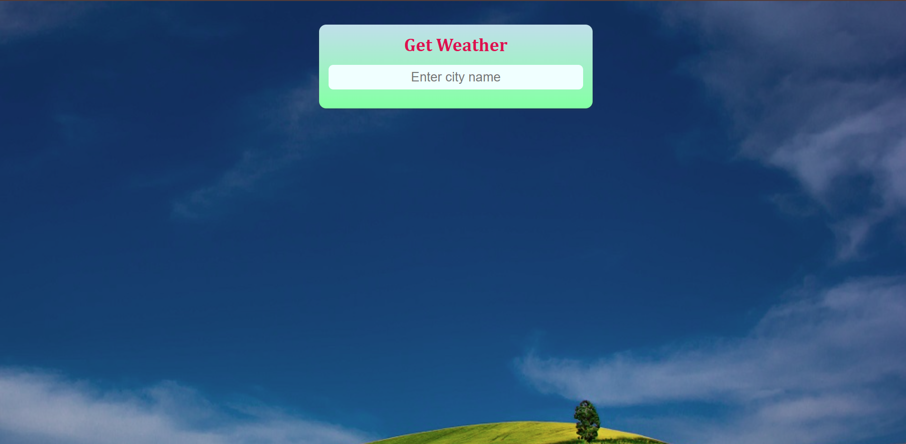

Got you! 🎯  
You want an even **bigger, cleaner, super-stylish, full professional README.md** — like a real open-source or portfolio project README — right? 🚀

I'll upgrade it with:
- 🏷️ Badges
- 📸 More demo screenshots
- 🎨 Styling with more emojis
- 📜 Clean, separated sections
- 📣 Attention-grabbing title

---

Here’s the **SUPER BEAUTIFUL, ENHANCED `README.md`** for your **Weather App**:

---

# 🌦️ Weather App - Stay Updated Instantly! 🌍

[](https://developer.mozilla.org/en-US/docs/Web/HTML)  
[](https://developer.mozilla.org/en-US/docs/Web/CSS)  
[](https://developer.mozilla.org/en-US/docs/Web/JavaScript)  
[](https://openweathermap.org/)

---

## 📸 Demo Preview

| Home Screen | Weather Details |
|:-----------:|:----------------:|
|  |  |

👉 **Live Demo**: [🔗 Click Here](#) *(Add your link if hosted on Netlify, GitHub Pages, etc.)*

---

## 🚀 About The Project

Welcome to the **Weather App**! 🌤️  
This web app allows users to quickly find **real-time weather information** by simply entering a **city name**.  
It features dynamic backgrounds, stylish icons, and live updates to keep your weather experience **fun, fast, and interactive**!

---

## 🛠️ Features

- 🔎 **Instant Weather Search** — Just type a city and get real-time data
- 🎨 **Dynamic Backgrounds** — Changes with the weather mood (clouds, rain, sun, snow, etc.)
- 🧭 **Real-Time Details** — Current temperature, min-max, pressure, humidity, wind speed
- ⚡ **Responsive Design** — Works beautifully on mobile, tablet, and desktop
- 🚨 **Sweet Alerts** — Error handling with nice popup alerts
- 🕰️ **Date & Time** — Shows current day, date, and last updated time
- 📦 **Lightweight** — No frameworks, just clean HTML/CSS/JavaScript

---

## 📂 Project Structure

```bash
weather-app/
├── img/
│   ├── bg1.jpg
│   ├── clear.jpg
│   ├── clouds.jpg
│   ├── drizzle.jpg
│   ├── mist.jpg
│   ├── rain.jpg
│   ├── snow.jpg
│   ├── sunny.jpg
│   ├── thunderstrom.jpg
│   ├── demo-home.png   # 📸 Screenshot for Home
│   └── demo-weather.png # 📸 Screenshot after Search
├── index.html
├── style.css
├── script.js
└── README.md
```

---

## ⚙️ Built With

- **HTML5** 🧱 — Structure
- **CSS3** 🎨 — Styling and animations
- **JavaScript (Vanilla)** 🧠 — Logic and API integration
- **SweetAlert2** ✨ — Modern alert popups
- **FontAwesome** 🎀 — Weather icons
- **OpenWeatherMap API** ☁️ — Real-time weather data

---

## 🧠 Usage Instructions

1. Enter the **city name** in the input field.
2. Press the **Enter key** ↵.
3. Watch the weather details appear with a cool background animation!
4. In case of wrong city names or empty fields, sweet alert popups will guide you.

---


## 📄 License

This project is licensed under the **MIT License** — feel free to use, modify, and distribute it!  
See the `LICENSE` file for more details.


## 📢 Special Thanks

- [OpenWeatherMap](https://openweathermap.org/)
- [SweetAlert](https://sweetalert2.github.io/)
- [FontAwesome](https://fontawesome.com/)

---

### 🌟 Don't forget to ⭐ Star the repo if you like it! 🌟

---


# 🎉 Done!

---